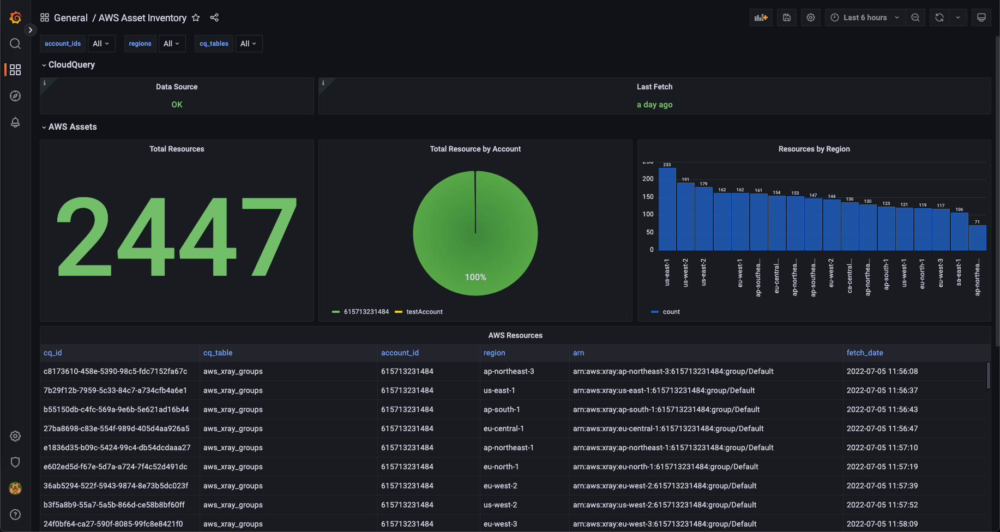

# Dashboards for CloudQuery

[CloudQuery](https://github.com/cloudquery/cloudquery) is an open-source cloud asset inventory powered by SQL.

You can connect PostgreSQL populated by CloudQuery to your favorite BI tools where you create dashboards for visualization, monitoring and alerting.

This repo contains pre-made dashboards for Grafana but you can create similar in any other BI platform.

Checkout those tutorials:
* [Building Open Source Cloud Asset Inventory with CloudQuery and Grafana](https://www.cloudquery.io/blog/open-source-cloud-asset-inventory-with-cloudquery-and-grafana)
* [Building Open Source Cloud Asset Inventory with CloudQuery and Apache Superset](https://www.cloudquery.io/blog/cloud-asset-inventory-cloudquery-apache-superset)
* [Building Open Source Cloud Asset Inventory with CloudQuery and AWS QuickSight](https://www.cloudquery.io/blog/cloud-asset-inventory-cloudquery-aws-quicksight)
* [Building Open Source Cloud Asset Inventory with MetaBase](https://www.cloudquery.io/blog/cloud-asset-inventory-cloudquery-metabase)

## What's inside?

Currently we have cloud asset inventory dashboards for AWS, Azure and GCP filterable by account_ids, regions and tables (project_ids for GCP) (more is coming).

### AWS Asset Inventory

#### Installation

1. Execute [this query](https://github.com/cloudquery/cq-provider-aws/blob/main/views/resources.sql) to add the `aws_resources` view.
2. Add the CloudQuery postgres database as a data source to Grafana (`Configuration -> Data Sources -> Add Data Source`)
3. Import [dashboards/aws/aws_asset_inventory.json](./dashboards/aws/aws_asset_inventory.json) into Grafana (`Import -> Upload JSON File`).

### AWS EC2 Public/Private Instances

#### Installation

1. Add the CloudQuery postgres database as a data source to Grafana (`Configuration -> Data Sources -> Add Data Source`)
2. Import [dashboards/aws/aws_ec2_public_private.json](./dashboards/aws/aws_ec2_public_private.json) into Grafana (`Import -> Upload JSON File`).

### Azure Asset Inventory

#### Installation

1. Execute [this query](https://github.com/cloudquery/cq-provider-azure/blob/main/views/resources.sql) to add the `azure_resources` view.
2. Add the CloudQuery postgres database as a data source to Grafana (`Configuration -> Data Sources -> Add Data Source`)
3. Import [dashboards/azure/azure_asset_inventory.json](./dashboards/azure/azure_asset_inventory.json) into Grafana (`Import -> Upload JSON File`).

### GCP Asset Inventory

#### Installation

1. Execute [this query](https://github.com/cloudquery/cq-provider-gcp/blob/main/views/resources.sql) to add the `gcp_resources` view.
2. Add the CloudQuery postgres database as a data source to Grafana (`Configuration -> Data Sources -> Add Data Source`)
3. Import [dashboards/gcp/gcp_asset_inventory.json](./dashboards/gcp/gcp_asset_inventory.json) into Grafana (`Import -> Upload JSON File`).

## Contributions

PRs are welcome with new dashboards. Also feel free to ask for new dashboards via [GitHub Issues](https://github.com/cloudquery/grafana-dashboards) or hop on [discord](https://cloudquery.io/discord)

